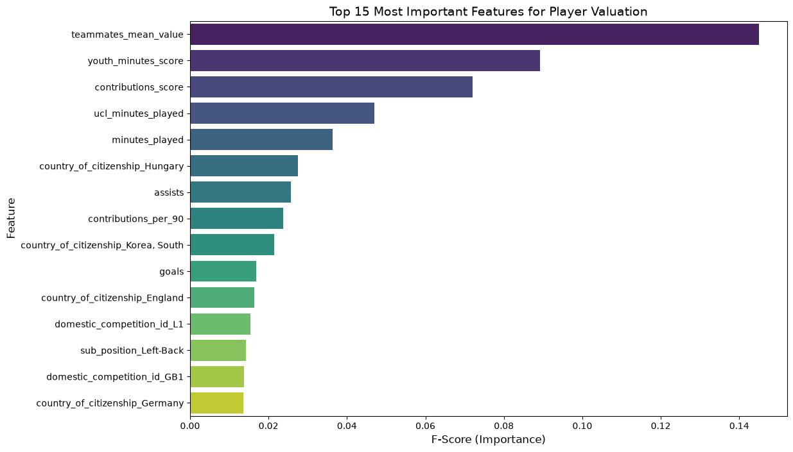

# ⚽ Football Player Market Value Predictor

An end-to-end Machine Learning pipeline that predicts the market value of football players based on their on-pitch performance, physical attributes, and club context. 

## 📌 Project Overview
This project processes real-world relational data (combining 5 datasets from Transfermarkt) to extract actionable football metrics. Using **XGBoost**, the model evaluates players similar to how a real scout or club would, achieving a robust **R² score of ~0.834** on unseen test data.

## 🛠️ Tech Stack
* **Language:** Python
* **Data Processing & EDA:** Pandas, NumPy, Seaborn, Matplotlib
* **Machine Learning:** Scikit-Learn, XGBoost
* **Model Serialization:** Joblib, native XGBoost JSON format
* **Package Manager:** uv

## 🧠 Data Architecture & Feature Engineering
The pipeline merges multiple tables (players, clubs, appearances, club_games, valuations) filtering for active players from recent seasons.

To make the model understand real-world football logic, several custom features were engineered:
* **UCL Impact:** Isolated UEFA Champions League minutes, goals, and assists as high-value market multipliers.
* **Age-Weighted Scores:** Created a custom peak-age decay formula to penalize older players while boosting young prospects with high minutes.
* **Defensive Clean Sheets:** Applied clean sheet tracking strictly to defensive positions (Goalkeepers, Centre-Backs, etc.).
* **Anti-Data Leakage Context:** Calculated the teammates_mean_value by excluding the player's own value from the club's total. This ensures the model understands the club's financial stature without peeking at the target variable.

## 📂 Project Structure

* `data/processed/` - Ready-for-ML datasets and output predictions
* `data/raw/` - Original Transfermarkt CSVs
* `data/test_players.json` - Sample input for batch predictions
* `images/` - Generated plots for evaluation
* `models/` - Saved XGBoost models and Joblib encoders
* `src/predict.py` - Core inference module
* `src/predict_batch.py` - Script for automated batch processing
* `01_data_processing.ipynb` - ETL & Feature Engineering 
* `02_modeling.ipynb` - Model Training & Evaluation
* `requirements.txt` - Project dependencies

## 🚀 How to Run

1. **Install dependencies:** (Assuming you are using uv or pip)
   `pip install -r requirements.txt`

2. **Data Processing:**
   Run the 01_data_processing.ipynb notebook to merge the raw CSVs, apply feature engineering, and generate ml_data_ready.csv.

3. **Model Training:**
   Run 02_modeling.ipynb to train the XGBoost model, calculate feature importances, and save the artifacts in the models/ directory.

4. **Make Predictions:**
   You can run batch predictions on custom player profiles by executing the script in the src/ folder. It reads from data/test_players.json and outputs a CSV in the processed folder.
   `python src/predict_batch.py`