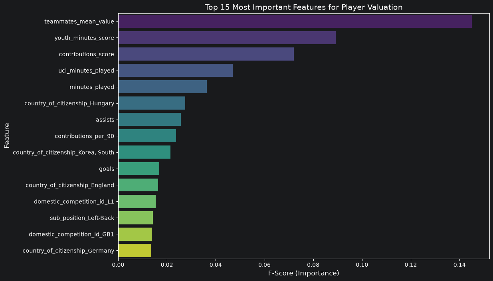

# ⚽ Football Player Market Value Predictor

An end-to-end Machine Learning pipeline that predicts the market value of football players based on their on-pitch performance, physical attributes, and club context. 

## 📌 Project Overview
This project processes real-world relational data (combining 5 datasets from Transfermarkt) to extract actionable football metrics. Using **XGBoost** with a log-transformed target variable, the model evaluates players similar to how a real scout or club would, achieving a robust **R²** score of **~0.81** and a Median Absolute Error of just **€0.38M** on unseen test data


## 🛠️ Tech Stack
* **Language:** Python
* **Data Processing & EDA:** Pandas, NumPy, Seaborn, Matplotlib
* **Machine Learning:** Scikit-Learn, XGBoost
* **Model Serialization:** Joblib, native XGBoost JSON format
* **Package Manager:** uv

## 🧠 Data Architecture & Feature Engineering
The pipeline merges multiple tables (players, clubs, appearances, club_games, valuations) filtering for active players from recent seasons.

To make the model understand real-world football logic, several custom features were engineered:
* **UCL Impact:** Isolated UEFA Champions League minutes, goals, and assists as high-value market multipliers.
* **Age-Weighted Scores:** Created a custom peak-age decay formula to penalize older players while boosting young prospects with high minutes.
* **Defensive Clean Sheets:** Applied clean sheet tracking strictly to defensive positions (Goalkeepers, Centre-Backs, etc.).
* **Anti-Data Leakage Context:** Calculated the teammates_mean_value by excluding the player's own value from the club's total. This ensures the model understands the club's financial stature without peeking at the target variable.



## 📊 Model Evaluation & Target Skewness Handling
The dataset of ~13,800 players is highly right-skewed (median value is €0.80M, while the maximum is €140.00M). Optimizing for standard absolute errors linearly forces the model to prioritize minimizing errors for €100M+ superstars, sacrificing accuracy for the bottom 90% of players.

To resolve this, the final model was trained on a **log-transformed target** using `np.log1p`, optimizing for relative (percentage) error, and reverted using `np.expm1` during inference.

| Model | Target Scaling | Learning Rate | MAE | MedAE (Median Error) | R² |
|---|---|---|---|---|---|
| Random Forest (Baseline) | Linear (Raw) | - | 1.6686 M € | - | 0.8237 |
| XGBoost (Initial) | Linear (Raw) | 0.05 | 1.6483 M € | 0.5121 M € | **0.8342** |
| **XGBoost (Final Production)** | **Log-Transformed (`log1p`)** | **0.06** | **1.5570 M €** | **0.3854 M €** | 0.8141 |

**Why the Production Model is Better for Real-World Scouting:**
* **~25% Reduction in Median Absolute Error (MedAE):** For 50% of the test set, the prediction error is now under €385,000 (down from €512,000).
* **Minimized Global MAE:** The Mean Absolute Error dropped to its lowest point in the pipeline (1.557M €).
* **Statistical Balance:** While R² dropped marginally (due to how the metric heavily penalizes squared errors on massive outliers), the model provides far more realistic and stable valuations for average league players and youth prospects without inflating them.

## 📂 Project Structure

* `data/processed/` - Ready-for-ML datasets and output predictions
* `data/raw/` - Original Transfermarkt CSVs
* `data/test_players.json` - Sample input for batch predictions
* `images/` - Generated plots for evaluation
* `models/` - Saved XGBoost models and Joblib encoders
* `src/predict.py` - Core inference module
* `src/predict_batch.py` - Script for automated batch processing
* `01_data_processing.ipynb` - ETL & Feature Engineering 
* `02_modeling.ipynb` - Model Training & Evaluation
* `requirements.txt` - Project dependencies

## 🚀 How to Run

1. **Install dependencies:** (Assuming you are using uv or pip)
   `pip install -r requirements.txt`

2. **Data Processing:**
   Run the 01_data_processing.ipynb notebook to merge the raw CSVs, apply feature engineering, and generate ml_data_ready.csv.

3. **Model Training:**
   Run 02_modeling.ipynb to train the XGBoost model on the log-transformed target, calculate feature importances, and save the artifacts in the models/ directory.

4. **Make Predictions:**
   You can run batch predictions on custom player profiles by executing the batch script in the src/ folder. It reads from data/test_players.json, applies np.expm1 to revert the log transformation, and outputs a CSV in the processed folder.
   `python src/predict_batch.py`

**Sample Output:**
```text
Player: English Star Striker
   -> Position: Centre-Forward | Age: 21 years
   -> Estimated Value: 43.56M EUR

Player: Romanian Wonderkid
   -> Position: Attacking Midfield | Age: 19 years
   -> Estimated Value: 2.88M EUR

Player: Veteran Dutch Defender
   -> Position: Centre-Back | Age: 31 years
   -> Estimated Value: 0.75M EUR
```
